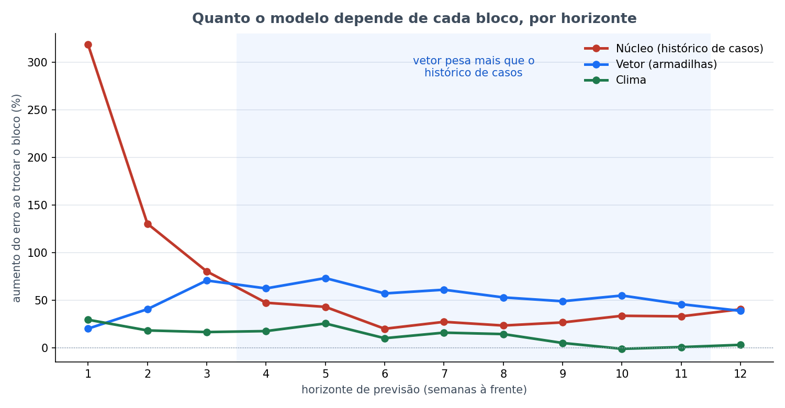

# Bloco 3 — Quanto o modelo depende de cada bloco, dentro do walk-forward

> **Rodado em 23/09/2026, das 22h00 às 22h21** (20 min). Parte da [bateria noturna](../README.md).
> Protocolo em [PRE_DECLARACAO.md](PRE_DECLARACAO.md). **Bloco descritivo**: não testa hipótese, não entra
> em correção múltipla, não muda a referência.

---

## Em uma frase

**A partir de 4 semanas à frente, o modelo depende mais do vetor do que do histórico de casos.**
Trocar as colunas do vetor por valores de outra semana aumenta o erro entre **46% e 73%** de h=4 a h=11;
trocar o histórico de casos aumenta entre **20% e 47%**. O clima quase não pesa em horizonte longo.

---

## 1. Por que este bloco existe

### A pergunta que motivou

O Vinicius perguntou em 23/09 como saber quais colunas mais importam no modelo, e se SHAP resolveria.

### Por que a importância de sempre não serve aqui

- **O algoritmo não oferece.** O `HistGradientBoostingRegressor` do scikit-learn não tem
  `feature_importances_`. A função do projeto que lê importância, `importancia_do_modelo`, levantaria
  `AttributeError` com ele — é um dos motivos, não documentado, pelos quais a seleção de clima roda com
  LightGBM.
- **Coluna a coluna não mede nada.** As colunas de um mesmo bloco são a mesma série deslocada no tempo.
  Correlação medida em 23/09: média de **0,91** entre as 6 colunas de casos, **0,85** entre as 6 de vetor.
  Trocar `casos_lag1` deixa `casos_lag2` intacta, 98% igual, e o modelo recupera quase tudo. O mesmo vale
  para SHAP, que divide o crédito entre colunas correlacionadas conforme a estrutura das árvores.
- **A pergunta que existe é por bloco.** "Entre `casos_lag1` e `casos_lag2`, qual importa mais" não tem
  resposta. "Quanto vale o vetor" tem — e é a pergunta da tese.

### Por que refazer uma medição do mesmo dia

Uma primeira medição por bloco, também de 23/09, usou um corte único: 80% mais antigo para treino, 20%
final para teste. Ela já mostrava o vetor crescendo com o horizonte. Mas o R² base dela em h=12 deu
**0,759**, contra **0,437** publicado no painel. Mesmo modelo, mesmos dados, procedimentos diferentes — o
número não podia ir ao painel ao lado do R² do walk-forward. Esta medição usa o **mesmo procedimento**
que gerou os números publicados.

---

## 2. Como foi medido

Em cada um dos ~290 cortes do walk-forward, em cada um dos 12 horizontes:

1. o modelo da referência é treinado uma vez, só com semanas cuja resposta já existia;
2. prevê a semana de teste com as colunas reais;
3. prevê de novo **20 vezes**, cada vez com as colunas de **um bloco inteiro** trocadas pelas de uma semana
   sorteada **do próprio treino**;
4. a importância do bloco naquele corte é quanto o erro absoluto médio subiu.

O sorteio vem do treino, nunca do futuro: o que se mede é o bloco carregando informação irrelevante para
aquela semana, não o bloco carregando informação que o modelo não podia ter.

Os três blocos:

| Bloco | Colunas |
|---|---|
| **Núcleo** | `casos`, `casos_lag1` a `lag4`, `casos_mm4`, `sem_sin`, `sem_cos` — 8 |
| **Clima** | `temp_media_lag4`, `umid_media`, `temp_media_lag3`, `temp_max`, `pressao_media_lag3`, `pressao_media_lag4` — 6 |
| **Vetor** | `aedes_aegypti_por_armadilha` e seus lags 1 a 4, `vetor_mm4` — 6 |

---

## 3. Trava de validação — passou

A previsão sem troca reproduziu o painel: MAE **98,0 / 219,7 / 272,6 / 278,8** e R²
**0,898 / 0,628 / 0,450 / 0,437** em h=1, 4, 8 e 12. A importância foi medida em cima exatamente do modelo
que está publicado.

---

## 4. Resultado

Aumento do erro (MAE) ao trocar cada bloco, período de avaliação (2024+):

| h | MAE real | R² | Núcleo | Clima | **Vetor** |
|---|---|---|---|---|---|
| 1 | 98,0 | 0,898 | **318%** | 29% | 20% |
| 2 | 162,0 | 0,746 | **130%** | 18% | 40% |
| 3 | 185,2 | 0,698 | **80%** | 16% | 71% |
| 4 | 219,7 | 0,628 | 47% | 17% | **62%** |
| 5 | 217,7 | 0,613 | 43% | 25% | **73%** |
| 6 | 262,7 | 0,442 | 20% | 10% | **57%** |
| 7 | 249,7 | 0,497 | 27% | 16% | **61%** |
| 8 | 272,6 | 0,450 | 23% | 14% | **53%** |
| 9 | 284,2 | 0,384 | 27% | 5% | **49%** |
| 10 | 280,6 | 0,418 | 33% | −1% | **55%** |
| 11 | 292,1 | 0,378 | 33% | 1% | **46%** |
| 12 | 278,8 | 0,437 | **40%** | 3% | 39% |

---

## 5. O que isso quer dizer

### Três regimes, e a virada entre h=3 e h=4

- **Até 3 semanas, o histórico de casos manda.** Em h=1, sem ele o erro mais que quadruplica. A semana que
  vem se parece muito com esta.
- **De 4 a 11 semanas, o vetor manda.** A virada acontece entre h=3 e h=4 e se sustenta por oito horizontes
  seguidos. É o intervalo em que o histórico de casos deixa de informar e a proliferação do mosquito passa
  a antecipar.
- **Em 12 semanas os dois empatam**, em torno de 40%.

### O clima some em horizonte longo

De h=9 em diante, trocar o clima muda o erro em menos de 5%, e em h=10 chega a melhorar. O que o clima
informa, o modelo já recebe por outro caminho — provavelmente pelo vetor, que responde ao clima.
**Hipótese, não medida.**

### ⚠️ O que este resultado NÃO diz

**Não diz que o vetor melhora a previsão.** São perguntas diferentes:

- **Este bloco responde:** o modelo **se apoia** no vetor? → Sim, e mais que em qualquer outra coisa a
  partir de 4 semanas.
- **O teste pareado M0 × M1 responde:** um modelo treinado **sem** o vetor prevê pior? → O resultado
  publicado é que não significativamente.

As duas coisas cabem juntas. Um modelo treinado com o vetor constrói as árvores em torno dele, e quebra
quando o vetor é trocado. Um modelo treinado sem o vetor reaprende pelo histórico de casos, que é
correlacionado com ele. **O vetor é o caminho que este modelo escolheu; não é, pelo que se mediu até
agora, um caminho sem alternativa.**

O [bloco 5](../bloco_5_algoritmos/) mede M0 × M1 nos três algoritmos com perda quantílica. Se lá tirar o
vetor não piorar em nenhum dos três, a leitura acima se confirma.

### Por que isso importa para a tese

- O eixo proposto pelo orientador em 21/09 é prever casos **a partir da** proliferação do vetor.
- Este bloco mostra, com o procedimento publicado, que o modelo atual **já faz isso** de 4 a 11 semanas.
- É argumento de que o vetor carrega informação que o modelo usa — e contra a leitura "o mosquito não
  importa", que o orientador pediu para não fazer.

---

## 6. Limitações

- **A troca cria combinações que não existem.** Uma semana de teste no verão pode receber o vetor de uma
  semana de inverno sorteada do treino. O modelo nunca viu esse par, e o erro pode subir mais do que
  subiria com uma perda "realista" de informação. Isso tende a **inflar** a importância dos blocos que
  interagem fortemente com os outros.
- **Descritivo, sem intervalo.** Não há teste estatístico nem intervalo de confiança. Os números mostram a
  forma da dependência, não a precisão dela.
- **Um modelo, uma semente.** Mede a referência adotada. Outro algoritmo pode se apoiar em outro bloco.

---

## 7. Arquivos

| Arquivo | O que é |
|---|---|
| [`PRE_DECLARACAO.md`](PRE_DECLARACAO.md) | protocolo |
| [`rodar.py`](rodar.py) | o script |
| `execucao.log` | a saída completa |
| `saidas/importancia_por_corte.csv` | um corte por linha: real, previsto e erro com cada bloco trocado |
| `saidas/importancia_por_horizonte.csv` | a tabela do §4 |
| `saidas/importancia_por_horizonte.png` | a figura do topo |
