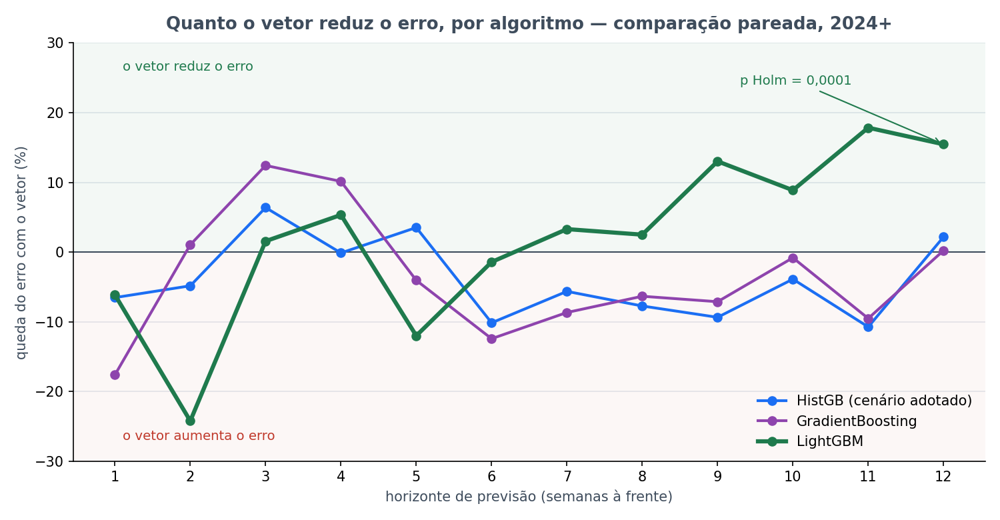

# Bloco 5 — Três algoritmos com perda quantílica, com e sem vetor

> **Rodado em 23/09/2026, das 22h21 às 23h51** (1h30). Parte da [bateria noturna](../README.md).
> Protocolo em [PRE_DECLARACAO.md](PRE_DECLARACAO.md). Estatística conferida por reimplementação
> independente — ver §6.

---

## Em uma frase

**O resultado "o vetor não melhora a previsão" depende do algoritmo.** No HistGB, que é o cenário
adotado, ele se confirma. No **LightGBM**, tirar o vetor **aumenta o erro de 3 meses em 18%**, com p de
Holm **0,0001** — e o LightGBM com vetor erra **11% menos** que o HistGB nesse horizonte. Mas o
LightGBM é o pior dos três no período que decide a escolha, então **a referência não muda**.

---

## 1. De onde veio este bloco

### Duas perguntas abertas

**Primeira — o HistGB ainda é o melhor?** O cenário adotado usa HistGradientBoosting porque ele venceu
o grid de 30/08/2026. Aquele grid rodou com o vazamento temporal. Na correção de 13/09 as 30
configurações foram reprocessadas e o HistGB com quantil 0,85 continuou em primeiro pela calibração, mas
nunca houve uma comparação pareada direta entre os algoritmos no protocolo limpo.

**Segunda — o resultado negativo do vetor é robusto?** O painel publica que acrescentar o vetor não
melhora a previsão de casos de forma significativa. Esse resultado vem de **um** algoritmo. Se ele
depender do algoritmo, a conclusão muda de natureza: deixa de ser "o vetor não carrega informação" e
passa a ser "este modelo não aproveita o vetor".

A segunda pergunta ficou mais urgente depois do [bloco 3](../bloco_3_importancia_por_bloco/), que mostrou
o modelo **se apoiando** mais no vetor do que no histórico de casos a partir de 4 semanas.

### Por que só três algoritmos

O cenário adotado usa **perda quantílica em 0,85**: o modelo estima um patamar que só é ultrapassado em
15% das vezes, o que é adequado para alarme. Dos nove algoritmos que o projeto já testou, só três
implementam essa perda: HistGradientBoosting, GradientBoosting e LightGBM. Os outros seis não podem
rodar o cenário adotado.

---

## 2. O que foi feito

Seis braços: cada algoritmo com vetor (**M1**) e sem vetor (**M0**). Hiperparâmetros idênticos aos do
grid de 30/08, quantil 0,85 nos três, mesmas 6 colunas de clima em todos — a seleção de clima não olha o
vetor, então M0 e M1 de um mesmo algoritmo recebem exatamente o mesmo clima.

| Algoritmo | Hiperparâmetros |
|---|---|
| HistGB | 250 iterações, taxa 0,05, até 15 folhas, folha mínima 5 |
| GradientBoosting | 250 árvores, taxa 0,05, profundidade 3, folha mínima 5 |
| LightGBM | 300 árvores, taxa 0,05, até 31 folhas, folha mínima 20 |

⚠️ **Os três não diferem só no algoritmo.** O LightGBM tem árvores maiores e folha mínima 4 vezes maior.
Qualquer diferença entre eles mistura algoritmo e hiperparâmetros.

### Um detalhe que quase gerou um número errado

Os braços **M0 têm 7 semanas a mais** que os M1 na avaliação. São as semanas cuja origem cai em
**maio e junho de 2024, durante a enchente**, quando as vistorias de armadilha pararam e o vetor ficou sem
dado. O M1 não consegue prever essas semanas; o M0, que não usa o vetor, consegue. O alvo delas cai de 1
a 12 semanas depois — em h=12, de 21/07 a 01/09/2024.

Uma primeira tabela descritiva desta análise comparou cada braço nas suas próprias semanas e produziu
números errados — o M0 do HistGB em h=1 aparecia com MAE 118,1 em vez de 92,0. A comparação **pareada
por `data_alvo`** exclui essas semanas e é a única que vale. É exatamente o motivo pelo qual a regra do
projeto exige pareamento.

---

## 3. Trava de validação — passou

O HistGB_M1 reproduziu o painel: MAE **98,0 / 219,7 / 272,6 / 278,8**, R² **0,898 / 0,628 / 0,450 /
0,437**. Também reproduziu o MAE de calibração da reordenação de 13/09: **42,0**, contra 42,02
documentado.

---

## 4. Pergunta 1 — outro algoritmo bate o HistGB?

Pareado, avaliação 2024+, Holm sobre 8 comparações. Queda do erro em relação ao HistGB; negativo é pior.

| Algoritmo | h=1 | h=4 | **h=8** | **h=12** |
|---|---|---|---|---|
| GradientBoosting | −10,3% | +6,3% | +3,7% | +2,7% |
| **LightGBM** | −35,6% | +7,6% | +14,9% | **+11,3%** \* |

\* p de Holm **0,0005**. Nenhum outro sobrevive; o mais próximo é LightGBM em h=8, com 0,087.

**Pelo critério pré-declarado** — trocar só se reduzir o erro em h=8 **e** h=12, os dois com p < 0,05 —
**nenhum algoritmo substitui o HistGB**. O LightGBM passa em h=12 e não passa em h=8.

### ⚠️ E o LightGBM é o pior no período que escolhe

| Algoritmo | MAE na calibração, antes de 2024 | MAE na avaliação, 2024+ |
|---|---|---|
| HistGB com vetor | **42,0** | 217,3 |
| GradientBoosting com vetor | 43,2 | 212,0 |
| LightGBM com vetor | **54,7** | **203,8** |

Média dos horizontes 1, 4, 8 e 12, nas semanas comuns a todos os braços.

O LightGBM é **30% pior** que o HistGB na calibração e o melhor na avaliação. Trocar para ele agora seria
escolher pelo período que serve de juiz — o que a regra do projeto proíbe, e que invalidaria a
independência do número.

**Hipótese, não medida:** a calibração (2020-2023) tem epidemias moderadas, com picos em torno de 800
casos por semana. A avaliação é dominada pelas **duas maiores epidemias da série**, 2024 e 2025, com picos
de 1.800 e 2.400. O LightGBM pode ser pior em temporada comum e melhor em temporada extrema — é o que a
vantagem concentrada nas semanas de pico sugere (§5).

---

## 5. Pergunta 2 — tirar o vetor muda o erro?

Pareado, avaliação 2024+, Holm sobre 12 comparações. Aqui a leitura é **queda do erro com o vetor**:
positivo quer dizer que o vetor ajuda.

| Algoritmo | h=1 | h=4 | h=8 | **h=12** |
|---|---|---|---|---|
| HistGB | −6,5% | −0,1% | −7,7% | +2,2% |
| GradientBoosting | −17,6% | +10,1% | −6,3% | +0,2% |
| **LightGBM** | −6,1% | +5,3% | +2,5% | **+15,5%** \* |

\* p de Holm **0,0001**. Nenhum outro dos 12 fica abaixo de 0,05.

### Não é um horizonte isolado

Os horizontes 2, 3, 5, 6, 7, 9, 10 e 11 **não** entram na família pré-declarada, mas as previsões deles
existem. Lidos de forma descritiva, sem teste, o padrão do LightGBM é contínuo:

| h | 7 | 8 | 9 | 10 | 11 | 12 |
|---|---|---|---|---|---|---|
| Queda do erro com vetor, LightGBM | +3,3% | +2,5% | **+13,0%** | +8,9% | **+17,8%** | **+15,5%** |
| Idem, HistGB | −5,6% | −7,7% | −9,4% | −3,9% | −10,7% | +2,2% |

No LightGBM o vetor reduz o erro nos **seis** horizontes de 7 a 12. No HistGB ele aumenta o erro em cinco
deles.

### Não é efeito de poucas semanas

Em h=12, o LightGBM com vetor erra menos que sem vetor em **74 das 102 semanas**. A vantagem é maior nas
semanas de pico — 146 casos a menos de erro, em média, nas 20% semanas de mais casos — mas existe também
fora delas: 19 casos a menos no restante.

### O que isso quer dizer

- **FATO:** no HistGB, o cenário adotado, o vetor não melhora a previsão. O resultado publicado se
  confirma no protocolo limpo.
- **FATO:** no LightGBM, o vetor melhora a previsão de 3 meses de forma significativa e robusta.
- **Consequência lógica dos dois fatos acima:** "o vetor não ajuda" não pode ser afirmado como
  propriedade dos dados. Ele vale para o HistGB com estes hiperparâmetros, neste período de avaliação.
- **Hipótese:** o que faz a diferença é a regularização. O LightGBM exige 20 semanas por folha; o HistGB,
  5. Com folhas pequenas, o HistGB pode se ajustar ao histórico de casos das temporadas moderadas e não
  deixar espaço para o vetor. O [bloco 6](../bloco_6_hiperparametros/) testa o HistGB com folha mínima 20.

### Por que isso importa para a tese

- O orientador disse em 21/09 que o vetor não impactar *"indica que deve ter algum problema na
  metodologia"*. Este bloco é a primeira evidência medida de que ele tinha razão: com outro algoritmo, o
  vetor impacta, e muito, no horizonte que a tese quer.
- Converge com o [bloco 3](../bloco_3_importancia_por_bloco/): a dependência do vetor cresce justamente a
  partir de 4 semanas, e o ganho do vetor no LightGBM aparece a partir de 7.
- ⚠️ **Não é resultado confirmatório.** A família 2 foi pré-declarada como leitura de robustez, não como
  hipótese da tese. O LightGBM não foi o algoritmo escolhido antes de olhar. Para virar achado, precisa de
  uma pré-declaração própria e, idealmente, da temporada 2026-2027, que ninguém viu ainda.

---

## 6. Verificação estatística independente

Pela regra do projeto, estatística é conferida por reimplementação independente. Um segundo agente, sem
ler o código deste bloco, recalculou tudo do CSV bruto:

| Verificação | Resultado |
|---|---|
| LightGBM × HistGB, h=12 | MAE 278,82 → 247,23, n=102, p Holm **0,000498** — confere |
| LightGBM com × sem vetor, h=12 | MAE 247,23 → 292,42, n=102, p Holm **0,000058** — confere |
| Demais 18 comparações | menor p Holm 0,0618 — nenhuma abaixo de 0,05, confere |
| `data_alvo` duplicada | nenhuma |
| Teste t pareado, vetor no LightGBM h=12 | p = 8,5 × 10⁻⁵ |
| Teste de sinal, idem | 74 de 102 semanas, p = 5,9 × 10⁻⁶ |
| Sem as 5 semanas mais extremas | vetor: p = 1,1 × 10⁻⁵ · algoritmo: p = 3,5 × 10⁻⁵ |

Os dois resultados sobrevivem a três testes diferentes e à retirada dos casos extremos.

---

## 6b. Emenda de 24/09/2026, ~03h20 — separação por temporada

Depois deste bloco ser documentado, o [bloco 7](../bloco_7_vetor_com_folha_20/) separou a avaliação por
ano, e a mesma separação foi aplicada aqui. Ela **tempera** o "robusto" do §5:

| LightGBM, vetor | h=8 | h=9 | h=10 | h=11 | h=12 |
|---|---|---|---|---|---|
| 2024 | ajuda, p < 0,0001 | ajuda, p < 0,0001 | ajuda, p < 0,0001 | ajuda, p = 0,0001 | ajuda, p = 0,0001 |
| 2025 | **atrapalha**, p = 0,31 | ajuda, p = 0,29 | **atrapalha**, p = 0,81 | ajuda, **p = 0,011** | ajuda, **p = 0,016** |

p bruto do Wilcoxon dentro de cada ano.

- **FATO:** a maior parte do efeito vem de 2024. Em 2025, ele se repete com significância só em 11 e 12
  semanas.
- **Consequência:** "robusto" no §5 quer dizer robusto a testes e a semanas extremas **dentro** do período
  de avaliação. Não quer dizer robusto entre temporadas. Com duas temporadas, isso não tem como ser
  afirmado.

## 7. Limitações

- **Algoritmo e hiperparâmetros andam juntos.** Não dá para dizer se é o LightGBM ou a folha mínima 20.
- **~100 semanas de avaliação, duas temporadas.** Ambas recordes. Um modelo melhor em 2024-2025 pode ser
  melhor só em temporada extrema.
- **O critério de decisão olhou h=8 e h=12.** O ganho do LightGBM em h=8 não é significativo. O efeito
  forte está de 9 a 12 semanas, horizontes que ficaram fora da família.
- **LightGBM é muito pior em h=1**, 35,6% a mais de erro que o HistGB. Nenhum algoritmo domina todos os
  horizontes.

---

## 8. Arquivos

| Arquivo | O que é |
|---|---|
| [`PRE_DECLARACAO.md`](PRE_DECLARACAO.md) | protocolo |
| [`rodar.py`](rodar.py) | o script |
| `execucao.log` | a saída completa |
| `saidas/previsoes_por_braco.csv` | uma previsão por linha, seis braços, 12 horizontes |
| `saidas/comparacoes_algoritmo.csv` | família 1, com p bruto e p de Holm |
| `saidas/comparacoes_vetor.csv` | família 2, idem |
| `saidas/ganho_do_vetor_pareado_todos_horizontes.csv` | a tabela descritiva dos 12 horizontes |
| `saidas/calibracao_e_avaliacao.csv` | MAE de cada braço nos dois períodos |
| `saidas/ganho_do_vetor_por_algoritmo.png` | a figura do topo |
| `saidas/NAO_USAR_mae_nao_pareada.csv` | ⚠️ **não pareada** — mantida só como registro do erro descrito no §2; não usar |
