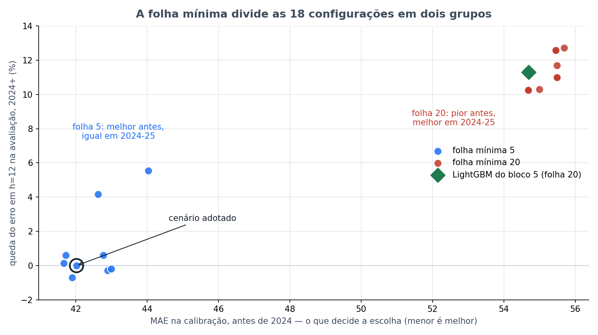

# Bloco 6 — Busca de hiperparâmetros do HistGB

> **Rodado em 24/09/2026, das 00h48 às 02h23** (1h35). Parte da [bateria noturna](../README.md).
> Protocolo em [PRE_DECLARACAO.md](PRE_DECLARACAO.md). Sugestão do Vinicius às ~20h50 de 23/09.

---

## Em uma frase

**Pelo teste pré-declarado, nenhuma configuração bate a referência** — a vencedora da calibração empata
com ela na avaliação. Mas a busca revelou que **um único hiperparâmetro, a folha mínima, divide tudo em
dois grupos**, e que é ele — não o algoritmo — que explicava a vantagem do LightGBM no bloco 5.

---

## 1. De onde veio

Os hiperparâmetros do cenário adotado **nunca foram buscados**. O grid de 30/08 variou algoritmo, função
de perda e presença do vetor; `max_iter=250`, `learning_rate=0.05`, `max_leaf_nodes=15` e
`min_samples_leaf=5` vieram fixos, herdados do cenário 1.

O risco de uma busca com ~400 semanas é achar uma configuração "melhor" por sorte. A trava foi separar em
duas fases: **escolher só pela calibração**, antes de 2024, e **levar uma única candidata** a um teste na
avaliação.

---

## 2. O que foi feito

18 configurações, quantil 0,85 e as 20 colunas fixos, horizontes 1, 4, 8 e 12:

| Hiperparâmetro | Valores |
|---|---|
| ritmo `learning_rate × max_iter` | 0,05 × 250 · 0,03 × 400 · 0,10 × 150 |
| `max_leaf_nodes`, tamanho da árvore | 15 · 7 · 31 |
| `min_samples_leaf`, folha mínima | 5 · 20 |

A referência rodou primeiro. As 18 terminaram antes do horário-limite das 05h.

---

## 3. Travas — passaram

- A referência reproduziu o painel: MAE **98,0 / 219,7 / 272,6 / 278,8**.
- E reproduziu o MAE de calibração da reordenação de 13/09: **42,02**, exatamente o número documentado.

---

## 4. Resultado do teste pré-declarado

### Fase 1 — ranking pela calibração

| # | Configuração | MAE calibração |
|---|---|---|
| 1 | ritmo 0,03 × 400 · árvore 15 · folha 5 | **41,66** |
| 2 | ritmo 0,03 × 400 · árvore 31 · folha 5 | 41,72 |
| 3 | ritmo 0,05 × 250 · árvore 31 · folha 5 | 41,90 |
| **4** | **referência: ritmo 0,05 × 250 · árvore 15 · folha 5** | **42,02** |
| 5–9 | demais com folha 5 | 42,6 a 44,0 |
| 10–18 | **todas com folha 20** | **54,7 a 55,7** |

A vencedora é só **0,9% melhor** que a referência na calibração. As nove com folha 5 formam um platô.

### Fase 2 — um único teste na avaliação

Vencedora contra referência, pareado, Holm sobre 4 horizontes:

| h | Referência | Vencedora | Queda do erro | p Holm |
|---|---|---|---|---|
| 1 | 98,0 | 105,4 | −7,5% | 1,000 |
| 4 | 219,7 | 212,4 | +3,3% | 1,000 |
| 8 | 272,6 | 272,3 | +0,1% | 1,000 |
| 12 | 278,8 | 278,4 | +0,2% | 1,000 |

**Veredito: não entra.** Em h=8 e h=12 a vencedora é praticamente idêntica à referência.

- **FATO:** a configuração herdada já estava no platô de boas configurações. Ajustar ritmo e tamanho da
  árvore não rende nada.

---

## 5. O que a busca revelou fora do teste

⚠️ **Tudo desta seção é descritivo.** Não fazia parte do teste pré-declarado e não troca a referência. As
previsões existem para as 18 configurações, então olhar para elas não custa CPU — mas o que se vê aqui é
hipótese para o próximo teste, não conclusão.

### Um hiperparâmetro manda em tudo

Média por grupo, avaliação pareada com a referência:

| | MAE calibração | h=1 | h=4 | h=8 | h=12 |
|---|---|---|---|---|---|
| folha mínima 5 (9 configurações) | 42,5 | −3,0% | +3% | +2,0% | +1,1% |
| folha mínima 20 (9 configurações) | **55,3** | **−39,5%** | +10% | **+16,6%** | **+11,4%** |

O ritmo e o tamanho da árvore quase não mexem em nada. A folha mínima vira o modelo:

- com folha 20, o erro **na calibração sobe 30%**;
- o erro **de 1 semana na avaliação sobe 40%**;
- e o erro **de 2 e 3 meses na avaliação cai 11% a 17%**.

### É o mesmo comportamento do LightGBM

| | MAE calibração | h=1 | h=8 | h=12 |
|---|---|---|---|---|
| HistGB com folha mínima 20 | 55,3 | −39,5% | +16,6% | +11,4% |
| LightGBM do bloco 5, folha mínima 20 | 54,7 | −35,6% | +14,9% | +11,3% |

Os dois números batem quase exatamente. O bloco 5 tinha deixado uma confusão em aberto: o LightGBM
diferia do HistGB no algoritmo **e** na folha mínima, que é 20 nele e 5 no HistGB. Este bloco separa as
duas coisas.

- **FATO descritivo:** o HistGB com folha mínima 20 reproduz o padrão do LightGBM.
- **Hipótese forte, a confirmar:** a vantagem do LightGBM em 3 meses vinha da folha mínima, não do
  algoritmo. O [bloco 7](../bloco_7_vetor_com_folha_20/) testa se, com folha 20, o vetor passa a ajudar o
  HistGB também.

### Por que a folha 20 é ruim na calibração e boa na avaliação

MAE de h=4 por ano do alvo, mesma configuração variando só a folha:

| Ano | Folha 5 | Folha 20 |
|---|---|---|
| 2020 | 1,1 | 3,3 |
| 2021 | 6,3 | 6,6 |
| **2022** | 110,1 | **130,0** |
| **2023** | 59,5 | **90,3** |

A diferença mora em **2022 e 2023**, as primeiras epidemias da série.

**Hipótese, não medida:** a folha mínima 20 exige 20 semanas parecidas para formar uma folha. Em 2022 o
modelo treinava com quase nenhuma semana epidêmica no histórico — 2018 a 2021 foram anos de pouquíssimos
casos. Com folha 20 ele não consegue isolar as poucas semanas de pico e subestima. Em 2024 e 2025, o treino
já inclui as epidemias de 2022 e 2023; a folha 20 passa a ter semanas epidêmicas suficientes, e a
regularização ajuda a extrapolar para os picos recordes.

### ⚠️ O que isso diz sobre o próprio método de escolha

Se a hipótese acima estiver certa, o critério de escolha do projeto tem um viés estrutural:

- o walk-forward é **expansivo**: o treino cresce a cada semana;
- a calibração é o período em que o treino era **pequeno e sem epidemias**;
- então escolher pela calibração **penaliza sistematicamente** configurações que precisam de mais
  histórico epidêmico para funcionar.

Não é motivo para quebrar a regra — escolher pela avaliação continuaria sendo escolher pelo juiz. É motivo
para desenhar a **próxima** pré-declaração de outro jeito: por exemplo, escolher numa janela de calibração
posterior a 2022, ou com origem deslizante.

---

## 6. Limitações

- **Grade pequena**: 3 × 3 × 2. A folha mínima foi testada em dois valores só. O ótimo pode estar entre 5 e
  20, ou acima.
- **Só 4 horizontes.** Os horizontes de 9 a 11, onde o vetor mais ajudou o LightGBM, não foram rodados.
- **Só com vetor.** O efeito da folha sobre o ganho do vetor é o que o bloco 7 mede.

---

## 7. Arquivos

| Arquivo | O que é |
|---|---|
| [`PRE_DECLARACAO.md`](PRE_DECLARACAO.md) | protocolo |
| [`rodar.py`](rodar.py) | o script |
| `execucao.log` | a saída completa |
| `saidas/previsoes_por_configuracao.csv` | uma previsão por linha, 18 configurações, 4 horizontes |
| `saidas/ranking_calibracao.csv` | a fase 1 |
| `saidas/comparacoes.csv` | a fase 2 |
| `saidas/descritivo_todas_configuracoes.csv` | a leitura descritiva do §5 |
| `saidas/folha_minima_divide_as_configuracoes.png` | a figura do topo |
