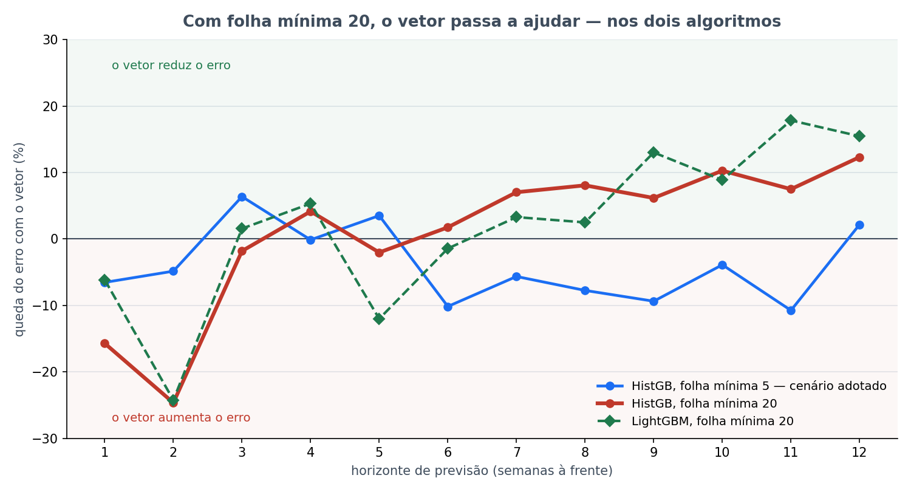

# Bloco 7 — O vetor no HistGB com folha mínima 20

> **Rodado em 24/09/2026, das 02h25 às 03h08** (43 min). Parte da [bateria noturna](../README.md).
> Protocolo em [PRE_DECLARACAO.md](PRE_DECLARACAO.md), escrito antes de rodar. Estatística conferida por
> reimplementação independente — ver §6.
>
> ⚠️ **Bloco exploratório.** A hipótese nasceu de resultados já vistos nos blocos 5 e 6. Testa um
> mecanismo; não confirma a hipótese da tese.

---

## Em uma frase

**O vetor não ajudava o cenário adotado por causa de um hiperparâmetro.** Com a folha mínima em 20, em
vez de 5, tirar o vetor aumenta o erro do HistGB em **9% em 2 meses** e **14% em 3 meses**, com p de Holm
0,006 e 0,015 — o mesmo padrão do LightGBM. **Mas o efeito é carregado quase todo pela temporada de 2024.**

---

## 1. A cadeia que levou a este bloco

1. **Bloco 5:** no LightGBM, o vetor reduz o erro de 3 meses em 15,5% (p Holm 0,0001). No HistGB do
   cenário adotado, não muda nada. Mas os dois diferem em duas coisas ao mesmo tempo: o algoritmo e a
   **folha mínima** — 20 no LightGBM, 5 no HistGB.
2. **Bloco 6:** o HistGB com folha mínima 20 se comporta exatamente como o LightGBM — pior na calibração
   (55,3 contra 54,7), pior em h=1 (−39,5% contra −35,6%), melhor em h=12 (+11,4% contra +11,3%).
3. **Hipótese deste bloco:** se a folha mínima é o que separa os dois, então no HistGB com folha 20 o vetor
   também deve passar a ajudar.

**O que é a folha mínima:** o menor número de semanas que uma folha da árvore pode conter. Com 5, a
árvore pode criar uma regra só para 5 semanas parecidas. Com 20, cada regra precisa se apoiar em 20. É uma
forma de regularização: impede o modelo de decorar casos raros.

---

## 2. O que foi feito

| Braço | Modelo | Vetor |
|---|---|---|
| referencia | HistGB, folha mínima 5 — cenário adotado | com |
| HistGB_folha20_M1 | HistGB, folha mínima 20, demais hiperparâmetros iguais | com |
| HistGB_folha20_M0 | idem | **sem** |

12 horizontes. Teste pré-declarado: M0 contra M1 do HistGB com folha 20, pareado, horizontes 1, 4, 8 e 12,
Holm sobre 4. O mecanismo é **apoiado** se tirar o vetor aumentar o erro em h=12 com p de Holm < 0,05.

---

## 3. Duas travas — passaram

- A referência reproduziu o painel: MAE **98,0 / 219,7 / 272,6 / 278,8**.
- O HistGB com folha 20 e vetor reproduziu **exatamente** a mesma configuração do bloco 6, nos quatro
  horizontes, até a segunda casa decimal. O modelo é determinístico, e o arranjo é o mesmo.

---

## 4. Resultado do teste

Queda do erro **com** o vetor, HistGB com folha mínima 20, pareado, avaliação 2024+:

| h | MAE com vetor | MAE sem vetor | Queda do erro com vetor | p Holm |
|---|---|---|---|---|
| 1 | 133,6 | 115,5 | −15,7% | 0,465 |
| 4 | 199,6 | 208,3 | +4,1% | 0,830 |
| **8** | 223,2 | 242,8 | **+8,1%** | **0,006** |
| **12** | 243,8 | 278,0 | **+12,3%** | **0,015** |

**O mecanismo é apoiado.** Com folha mínima 20, o vetor reduz o erro em 2 e em 3 meses de forma
significativa. Em 1 semana, atrapalha — sem significância.

### Os 12 horizontes, de forma descritiva

| h | 1 | 2 | 3 | 4 | 5 | 6 | 7 | 8 | 9 | 10 | 11 | 12 |
|---|---|---|---|---|---|---|---|---|---|---|---|---|
| folha 20 | −15,7 | −24,6 | −1,8 | +4,1 | −2,0 | +1,8 | +7,0 | +8,1 | +6,2 | +10,3 | +7,5 | +12,3 |
| folha 5, adotado | −6,5 | −4,8 | +6,4 | −0,1 | +3,5 | −10,1 | −5,6 | −7,7 | −9,4 | −3,9 | −10,7 | +2,2 |

Queda do erro com o vetor, em %. Com folha 20, o vetor ajuda de **h=6 a h=12, sete horizontes seguidos**.
Com folha 5, atrapalha em seis desses sete.

---

## 5. ⚠️ O que a separação por temporada mostrou

A avaliação cobre duas temporadas, 2024 e 2025. O verificador independente separou uma da outra, e a
mesma separação foi aplicada ao LightGBM do bloco 5:

| Modelo | h | 2024 | 2025 |
|---|---|---|---|
| HistGB folha 20 | 8 | vetor ajuda, **p = 1,4 × 10⁻⁶** | vetor **atrapalha**, p = 0,70 |
| HistGB folha 20 | 12 | vetor ajuda, **p = 0,004** | vetor ajuda, p = 0,42 |
| LightGBM | 8 | vetor ajuda, **p < 0,0001** | vetor **atrapalha**, p = 0,31 |
| LightGBM | 11 | vetor ajuda, **p = 0,0001** | vetor ajuda, **p = 0,011** |
| LightGBM | 12 | vetor ajuda, **p = 0,0001** | vetor ajuda, **p = 0,016** |

p bruto do Wilcoxon dentro de cada ano, sem correção.

### O que isso quer dizer

- **FATO:** em 2024, o vetor ajuda muito e com significância, em todos os horizontes longos, nos dois
  modelos com folha 20.
- **FATO:** em 2025, o efeito só se repete com significância no **LightGBM, em 11 e 12 semanas**. Em
  8 semanas, inverte nos dois modelos.
- **FATO:** o horizonte de **3 meses** é o mais robusto: mantém a direção nas duas temporadas, nos dois
  modelos.
- **Consequência:** o resultado agregado é real, mas **uma temporada carrega a maior parte dele**. Duas
  temporadas não bastam para dizer que é propriedade da doença e não daquele ano.

### Uma hipótese para o padrão, não medida

2024 foi a primeira epidemia gigante da série, com pico de 1.800 casos por semana, contra ~800 nas
anteriores. Um modelo sem vetor só tem o histórico de casos, e **nenhum histórico anterior anunciava uma
temporada daquele tamanho**. O vetor anunciava: a densidade no começo de 2024 está entre as mais altas da
série.

Em 2025 o pico foi ainda maior, 2.400, mas o modelo já tinha 2024 no treino. O histórico de casos passou a
carregar parte do que antes só o vetor carregava.

Se isso estiver certo, **o vetor vale mais justamente quando a temporada foge do que já se viu** — que é o
caso de maior valor para a vigilância. É hipótese de duas temporadas. A temporada 2026-2027 testa.

---

## 6. Verificação estatística independente

| Verificação | Resultado |
|---|---|
| Os 4 p de Holm | batem até a terceira casa: 0,0056 · 0,0151 · 0,465 · 0,830 |
| `data_alvo` duplicada | nenhuma |
| h=8 — teste t pareado | **p = 0,149, não significativo** |
| h=8 — teste de sinal | 69 de 102 semanas, p = 0,0005 |
| h=12 — teste t pareado | p = 0,003 |
| h=12 — teste de sinal | 65 de 102 semanas, p = 0,007 |
| Sem as 5 semanas mais extremas | h=8: p = 0,001 · h=12: p = 0,013 |

Em h=8, o Wilcoxon e o teste de sinal acusam efeito, e o teste t não. Os dois primeiros olham a direção de
cada semana; o t olha a média. A divergência indica efeito **concentrado**, não uniforme — coerente com o
§5, em que 2025 puxa para o lado oposto. **h=12 passa nos três testes.**

---

## 7. O que muda, e o que não muda

### Não muda

- **A referência.** O HistGB com folha 20 é 32% pior na calibração (55,45 contra 42,02), que é o critério de
  escolha, e 36% pior em 1 semana. E este bloco é exploratório.

### Muda

- **A frase "o vetor não melhora a previsão" não se sustenta como está.** O que se mediu é que o vetor não
  melhora a previsão **do HistGB com folha mínima 5**, que é uma configuração herdada e nunca buscada.
  Com folha mínima 20, em dois algoritmos diferentes, o vetor melhora a previsão de 3 meses.
- **A pergunta do orientador ganha uma candidata a resposta.** Em 21/09 ele disse que o vetor não
  impactar *"indica que deve ter algum problema na metodologia"*. Um candidato forte a esse problema: a
  folha mínima 5, **herdada e nunca buscada**, com a qual o modelo não aproveita o vetor. E o critério de
  escolha do projeto tende a preferi-la, porque penaliza as configurações que precisam de histórico
  epidêmico — ver o [bloco 6](../bloco_6_hiperparametros/), §5. É candidato, não diagnóstico fechado.

### O que fazer com isso

Uma pré-declaração **confirmatória**, escrita antes de olhar qualquer coisa nova:

- hipótese: com folha mínima 20, o vetor reduz o erro de 3 meses;
- dado novo: a temporada **2026-2027**, que ninguém viu;
- e um desenho que resolva o viés da calibração — por exemplo, um modelo por faixa de horizonte, folha 5
  até 3 semanas e folha 20 dali em diante.

---

## 8. Arquivos

| Arquivo | O que é |
|---|---|
| [`PRE_DECLARACAO.md`](PRE_DECLARACAO.md) | protocolo |
| [`rodar.py`](rodar.py) | o script |
| `execucao.log` | a saída completa |
| `saidas/previsoes_por_braco.csv` | uma previsão por linha, três braços, 12 horizontes |
| `saidas/comparacoes.csv` | o teste do §4 |
| `saidas/descritivo_12_horizontes.csv` | a leitura descritiva dos 12 horizontes |
| `saidas/vetor_com_folha_20.png` | a figura do topo |
