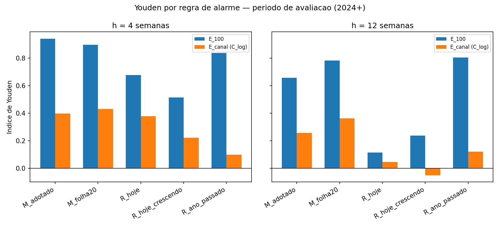

# O alarme do modelo contra o canal endêmico

> **Rodado em 25/09/2026**, a pedido do Vinicius. Protocolo em [PRE_DECLARACAO.md](PRE_DECLARACAO.md),
> escrito antes de calcular. Certificado por reimplementação independente em
> [CERTIFICACAO.md](CERTIFICACAO.md). Nenhum modelo treinado.
>
> ⚠️ **Rodada exploratória.** As previsões de 2024+ já tinham sido vistas.

---

## Em uma frase

**Em 1 mês, o alarme do modelo é o melhor. Em 3 meses, ele é muito melhor que esperar o surto aparecer,
mas empata com a regra "o ano passado passou de 100 casos".** O critério pré-declarado não se cumpriu.

---

## 1. Trava — passou

O cenário adotado reproduziu a métrica de 13/09: **h=12: 76,9% / 81,1% / 2,3 falsos por ano · h=4:
97,1% / 94,3% / 0,7**.

---

## 2. Surto = mais de 100 casos na semana

Avaliação 2024+, 102 semanas. Youden = sensibilidade + especificidade − 1; quanto mais perto de 1, melhor.

| Regra | 1 mês: pega | 1 mês: Youden | 3 meses: pega | 3 meses: precisão | 3 meses: Youden |
|---|---|---|---|---|---|
| **Cenário adotado** | 97,1% | **0,94** | 76,9% | 81,1% | 0,66 |
| **HistGB folha 20** | 97,1% | 0,90 | 84,6% | 89,2% | 0,78 |
| O ano passado passou de 100 | 85,3% | 0,84 | 82,1% | **97,0%** | **0,81** |
| Hoje já passou de 100 | 76,5% | 0,68 | 38,5% | 46,9% | 0,12 |

- **1 mês:** o modelo vence as duas regras. Pega 97% dos surtos com 94% de precisão.
- **3 meses:**
  - o modelo é **muito melhor que olhar a situação de hoje**. É o único resultado significativo da
    rodada: p Holm **0,0006** no cenário adotado e **< 0,0001** no folha 20;
  - mas **"o ano passado passou de 100" empata ou vence**: Youden 0,81 contra 0,78 e 0,66, sem
    significância para nenhum lado.
- ⚠️ **Correção de leitura:** o relatório do implementador dizia que o modelo vencia as duas regras nos dois
  eventos. **Não vence:** no evento de 100 casos em 3 meses, a regra do ano passado fica à frente.

---

## 3. Surto = acima do canal endêmico em log (Singh et al. 2026)

| Regra | 1 mês: Youden | 3 meses: pega | 3 meses: precisão | 3 meses: Youden |
|---|---|---|---|---|
| **HistGB folha 20** | **0,43** | 47,4% | 50,0% | **0,36** |
| **Cenário adotado** | 0,40 | 36,8% | 43,8% | 0,26 |
| Hoje acima do canal | 0,38 | 31,6% | 21,4% | 0,05 |
| Hoje acima e crescendo | 0,22 | 15,8% | 15,0% | −0,05 |
| O ano passado acima do canal | 0,10 | 15,8% | 50,0% | 0,12 |

- **O modelo vence as regras em 3 meses**, mas **sem significância**: p bruto 0,034, p Holm 0,40.
- **Os números absolutos são baixos para todo mundo.** O evento "acima do canal" é difícil de prever em
  Porto Alegre.
- **A regra da Malásia, acima e crescendo, é a pior aqui.** O resultado deles não se transfere, como os
  próprios autores avisaram.

---

## 4. 🔴 O canal endêmico não se adapta bem a Porto Alegre

- **FATO:** com 2018-2021 quase sem casos, o limite do canal é **0** em muitas semanas fora da temporada.
  Na semana 39 de 2024, com 7 casos, o limite era 0: **qualquer caso vira "epidemia"**.
- A escala log ajuda, mas não resolve: o canal só fica informativo depois de alguns anos com dengue.
- **Para a vigilância:** o canal clássico, calculado com os anos anteriores, ainda não é uma boa régua de
  epidemia em Porto Alegre. Hoje, um limiar fixo de casos é mais estável.

---

## 5. Critério pré-declarado

| Critério | Veredito |
|---|---|
| Modelo vence o canal em 3 meses, no evento do canal, com significância | **Não**: vence em Youden, com p Holm 0,40 |
| Leitura descritiva: vence as duas regras nos dois eventos em 3 meses | **Não**: no evento de 100 casos, a regra do ano passado fica à frente |

---

## 6. O que muda

- **O alarme de 1 mês é um resultado positivo defensável:** vence as regras simples no evento de 100
  casos.
- **Em 3 meses, o alarme repete a história do número de casos:** a sazonalidade, "o ano passado", carrega
  quase toda a informação.
- **O valor do modelo em 3 meses é a antecipação:** contra "esperar o surto aparecer", o ganho é grande e
  significativo. Contra "lembrar do ano passado", não há ganho.

---

## 7. Arquivos

| Arquivo | O que é |
|---|---|
| [`PRE_DECLARACAO.md`](PRE_DECLARACAO.md) | protocolo |
| [`rodar.py`](rodar.py) · `execucao.log` | o script e a saída |
| `saidas/metricas_por_regra.csv` | todas as métricas, por evento, canal, regra, horizonte e período |
| `saidas/mcnemar_holm.csv` | os 16 testes |
| `saidas/canais_por_semana.csv` | os limites dos 3 canais, semana a semana |
| `saidas/figura_youden_h4_h12.png` | a figura do topo |
