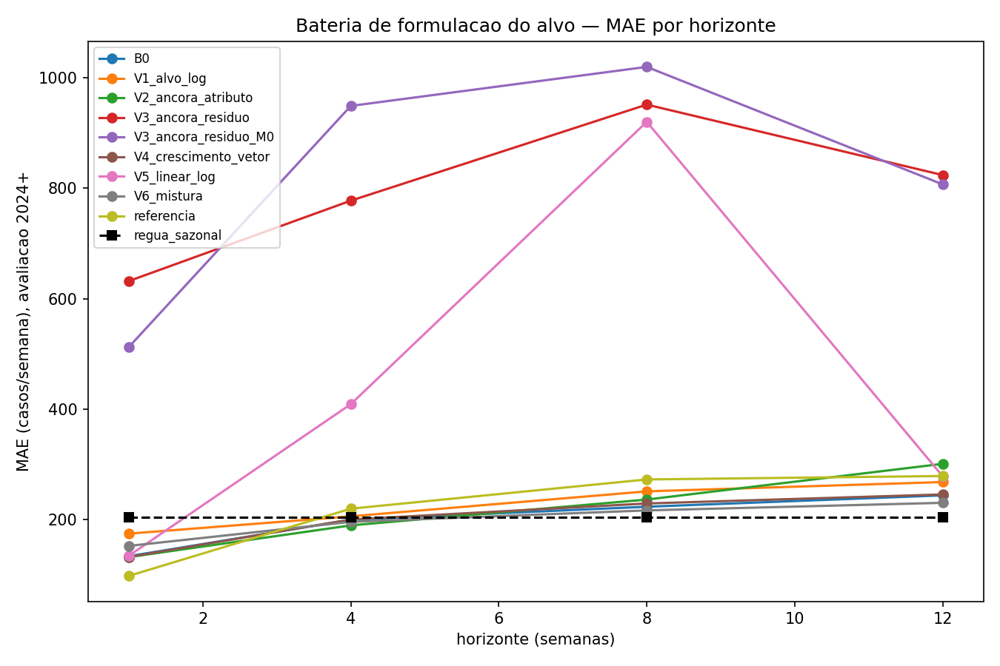

# Bateria de formulação do alvo — mudar como o modelo recebe a informação sazonal

> **Rodada em 25/09/2026, das 14h11 às 14h25**, cerca de 14 min com 1 thread. Pré-declaração gravada às
> 13h40.
> Protocolo em [PRE_DECLARACAO.md](PRE_DECLARACAO.md), escrito antes de rodar. Revisão do código antes
> da rodada em [REVISAO_PRE_RODADA.md](REVISAO_PRE_RODADA.md).
>
> ⚠️ **Rodada exploratória.** O período de avaliação já tinha sido visto na
> [régua das regras simples](../2026-09-25_regua_regras_simples/).

---

## Em uma frase

**Nenhuma das seis variantes melhora o modelo em 3 meses, e nenhuma bate a regra "mesma semana do ano
passado".** As duas variantes que usam a informação de forma multiplicativa explodem, com previsões de até
27 mil casos numa semana que teve 1.855.

---

## 1. De onde veio

- A régua de 25/09 mostrou o HistGB com folha 20 e vetor perdendo para a regra sazonal: MAE **243,8 contra
  217,8** em h=12.
- A hipótese era que a informação sazonal existe, mas chega ao modelo desalinhada: o lag de 52 semanas
  testado antes era contado da **origem**, e a regra usa a semana **alvo** do ano anterior.
- A [varredura de literatura](../2026-09-25_varredura_literatura/) sugeriu mais três caminhos: ensemble com
  a régua, taxa de crescimento do vetor e um modelo que extrapola.

---

## 2. Travas — as três passaram

| Trava | Resultado |
|---|---|
| 1. `referencia` reproduz o painel | MAE 98,0 / 219,7 / 272,6 / 278,8 · R² 0,898 / 0,628 / 0,450 / 0,437 |
| 2. `B0` reproduz o bloco 7 exatamente | MAE 133,6 / 199,6 / 223,2 / 243,8 · n = 102 por horizonte |
| 3. Clima idêntico nos 8 braços treinados | as mesmas 6 colunas em todos |

---

## 3. Resultado pelo critério pré-declarado

MAE na avaliação, 2024 em diante, 102 semanas pareadas por horizonte. Queda do erro em relação ao `B0`;
negativo quer dizer que piorou.

| Braço | h=1 | h=4 | h=8 | h=12 | h=12 contra o B0 |
|---|---|---|---|---|---|
| `B0` | 133,6 | 199,6 | 223,2 | **243,8** | — |
| `V1_alvo_log` | 174,4 | 205,8 | 251,0 | 267,9 | −9,9% |
| `V2_ancora_atributo` | 132,0 | 189,4 | 236,2 | 300,9 | −23,4% |
| `V3_ancora_residuo` | 632,0 | 777,6 | 951,6 | 824,0 | **−238%** 🔴 |
| `V4_crescimento_vetor` | 132,3 | 200,1 | 229,1 | 245,5 | −0,7% |
| `V5_linear_log` | 134,5 | 409,0 | 920,4 | 278,4 | −14,2% |
| `V6_mistura` | 152,2 | 195,8 | 216,6 | **230,3** | **+5,5%** |
| régua sazonal | 202,1 | 213,2 | 216,2 | **217,8** | — |

### Família F1 — a variante melhora o B0?

- **Nenhuma melhora com significância**, em nenhum horizonte.
- As 4 comparações que sobrevivem a Holm são **pioras**: `V3` em h=1, 8 e 12, e `V5` em h=8.
- **Veredito: nenhuma variante melhora o modelo.**

### Família F2 — a variante bate a régua sazonal?

- **Nenhuma bate.** As 4 comparações significativas são pioras: `V2` em h=12, `V3` em h=8 e 12, `V5` em h=8.
- O `B0` perde para a régua em h=12 por 11,9%, sem significância, como a régua já tinha medido.
- **Veredito: nenhuma variante bate a régua.**

### Família F3 — o vetor vale dentro do V3?

- Tirar o vetor piora o `V3` em h=4 e h=12, com p Holm **0,0001** e **0,013**.
- ⚠️ **Não é evidência sobre o valor do vetor.** O `V3` erra 3,4 vezes mais que o `B0`. O vetor reduz o
  tamanho de uma explosão, não o erro de um modelo útil.

### Candidatas à rodada confirmatória

**Nenhuma.** A réplica condicional com LightGBM **não foi disparada**, porque ela só roda para candidatas.

---

## 4. O que cada variante mostrou

### V3 e V5 explodem: a informação multiplicativa amplifica o erro

- **FATO:** o `V3` previu **10.524** casos para 23/03/2025, que teve **1.801**. O `V5` previu **27.258** para
  21/04/2024, que teve **1.855**.
- **Mecanismo, confirmado pela certificação mecânica** reproduzindo as duas previsões do zero:
  - **V3:** a âncora de 23/03/2025 é **1.109** casos, acima de toda âncora que o treino viu, cujo máximo
    é **879**. O resíduo previsto é **2,25** em log, ou seja, **9,5 vezes** a âncora. Esse resíduo está no
    percentil 83 do histórico, nada anômalo isolado. A explosão nasce do produto: âncora fora da faixa ×
    crescimento alto, 1.109 × 9,5 ≈ 10.524.
  - **V5:** `casos` e seus lags 1 a 4 e a média móvel são quase a mesma coluna. Sem penalização, como a
    pré-declaração exigiu, a regressão linear dá a elas coeficientes enormes e de sinais opostos. Uma
    semana fora do padrão desequilibra a soma, e o `expm1` transforma o desequilíbrio em 27 mil.
- ⚠️ **O V5 foi reprovado com `alpha=0`, como pré-declarado.** Um linear com penalização não foi testado.
- **Limitação de arquitetura:** qualquer formulação que multiplique a âncora por um crescimento aprendido
  herda a instabilidade de uma série com 4 temporadas epidêmicas.

### V2: dar a régua ao modelo como atributo piora

- **FATO:** com a coluna `ancora`, o erro de h=12 sobe de 243,8 para **300,9**.
- **FATO:** o estrago mora em 2025 e 2026. MAE em h=12 por ano do alvo:

  | Ano | B0 | V2 |
  |---|---|---|
  | 2024 | 322,3 | 354,1 |
  | 2025 | 196,3 | 272,0 |
  | 2026 | 30,7 | **122,6** |

- **FATO:** nas semanas com menos de 100 casos, o erro do `V2` é **81,9 contra 26,4** do B0. A âncora faz o
  modelo esperar uma temporada grande quando ela não vem.
- **Isto refuta a hipótese que motivou a rodada.** A informação sazonal alinhada chegou ao modelo, e ele
  ficou pior.

### V1: o log ajuda na baixa e atrapalha no pico

- **FATO:** nas semanas com menos de 100 casos, o erro cai de 26,4 para **13,4**. Nas semanas com 100 ou
  mais, sobe de 594,9 para **679,1**.
- Na calibração epidêmica de 2022-2023 o `V1` é melhor que o `B0` em h=1, 4 e 8. Na avaliação, pior.

### V4: a velocidade do vetor não muda nada

- **FATO:** −0,7% em h=12, p bruto 0,86. O modelo já extraía dos lags o que a taxa de crescimento traz.

### V6: a única direção consistente, e pequena

- **FATO:** a mistura de 50% do modelo com 50% da régua tem erro menor que o `B0` em h=12 em **quatro anos
  seguidos**:

  | Ano | B0 | V6 |
  |---|---|---|
  | 2022 | 119,2 | 116,4 |
  | 2023 | 65,8 | 56,2 |
  | 2024 | 322,3 | 301,4 |
  | 2025 | 196,3 | 187,4 |

- **FATO:** também é melhor na calibração epidêmica, com 84,5 contra 90,9 em h=12.
- **Mas:** +5,5% sem significância (p bruto 0,24), e ainda perde para a régua pura em h=12: **230,3 contra
  217,8**.
- **Leitura, não teste:** metade da régua melhora o modelo; a régua inteira seria melhor ainda. O modelo, em
  3 meses, adiciona pouco ao que a régua já sabe.

---

## 5. O que muda, e o que não muda

### Não muda

- **A referência.** Nada passou no critério.
- **A régua sazonal segue invicta em 3 meses** contra tudo o que o projeto já testou.

### Muda

- **A explicação "a informação chega desalinhada" cai.** Alinhada, ela piora o modelo.
- **O limite parece ser de dado, não de formulação:** 4 temporadas epidêmicas, cada uma maior que a
  anterior. Nenhuma forma de apresentar o histórico ensina o modelo a antecipar o tamanho da próxima.
  ⏳ Hipótese, não medida.

---

## 6. Incidente de execução

- O primeiro comando deixou o `V6_mistura` fora da lista de braços, e a consolidação parou com erro.
  O desenho não mudou: o `V6` é calculado a partir do `B0` sem treinar nada.
- Correção: nova chamada só com `B0` e `V6`. O `B0` saiu **idêntico** nas duas chamadas, com diferença
  máxima 0,0 em 1.159 previsões.
- Logs: [`execucao_1_bracos_treinados.log`](execucao_1_bracos_treinados.log) ·
  [`execucao_2_v6.log`](execucao_2_v6.log) · [`execucao_3_consolidacao.log`](execucao_3_consolidacao.log).

---

## 7. Certificação

| Certificação | Veredito |
|---|---|
| [Estatística](CERTIFICACAO_ESTATISTICA.md), reimplementação independente | ✅ aprovada: travas, MAE, as 3 famílias, o V6 e o critério de decisão batem; zero duplicatas |
| [Mecânica](CERTIFICACAO_MECANICA.md), reprodução do zero das previsões extremas | ✅ aprovada: V3 = 10.524,2 e V5 = 27.257,7 reproduzidos; âncora do V2 conferida por data; **nenhum bug** |

---

## 8. Arquivos

| Arquivo | O que é |
|---|---|
| [`PRE_DECLARACAO.md`](PRE_DECLARACAO.md) | protocolo |
| [`rodar.py`](rodar.py) | o script |
| `saidas/previsoes_por_braco.csv` | uma previsão por linha, 9 braços, 4 horizontes |
| `saidas/familia_f1_variante_vs_b0.csv` | F1 |
| `saidas/familia_f2_variante_vs_regua_sazonal.csv` | F2 |
| `saidas/familia_f3_vetor_dentro_do_v3.csv` | F3 |
| `saidas/leitura_*.csv` | calibração epidêmica, MAE por ano, MAE por faixa de casos |
| `saidas/figura_mae_por_horizonte.png` | a figura do topo |
