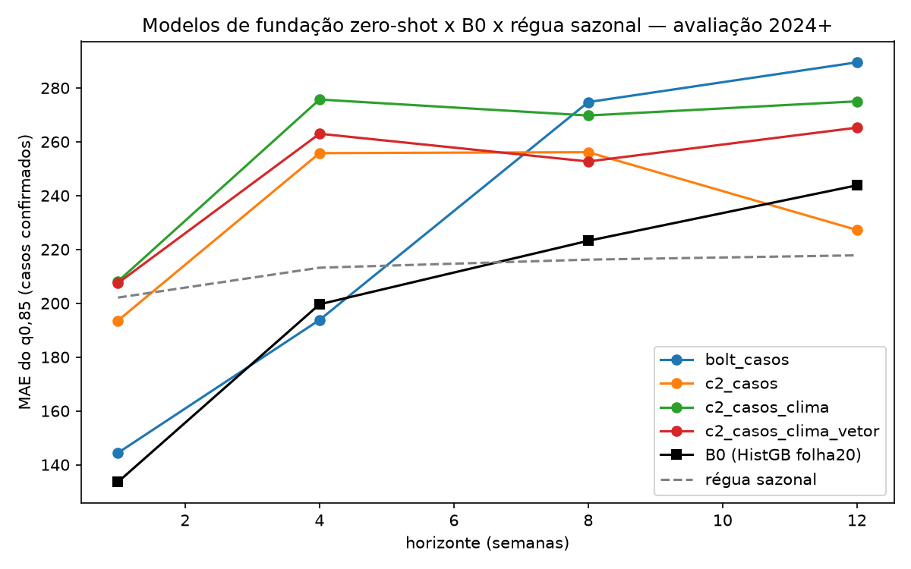

# Modelos de fundação em modo zero-shot — Chronos-Bolt e Chronos-2

> **Rodada em 25/09/2026**, com autorização do Vinicius ("vai la, vamos ver o que aparece, tentar nao
> custa"). Protocolo em [PRE_DECLARACAO.md](PRE_DECLARACAO.md), escrito antes de qualquer previsão com
> dado do projeto. Ambiente e versões em [AMBIENTE.md](AMBIENTE.md).
>
> ⚠️ **Rodada exploratória.** A avaliação 2024+ já tinha sido vista.

---

## Em uma frase

**Nenhum modelo de fundação bate a regra "mesma semana do ano passado" em 3 meses, nem melhora o nosso
modelo.** Mas, dentro do Chronos-2, o vetor reduz o erro em 1, 2 e 3 meses com significância, e esse
efeito só aparece em 2024-2025.

---

## 1. Propósito

- **O que é um modelo de fundação:** um modelo de previsão pré-treinado em milhões de séries de outras
  áreas, que prevê uma série nova sem treinar nela.
- **Por que testar:** a régua de 25/09 mostrou o modelo perdendo para a regra sazonal, e seis formulações
  novas não mudaram isso. A hipótese é que o limite vem de ter só 4 temporadas epidêmicas. Um modelo que já
  viu milhões de curvas traz conhecimento de fora.
- **A varredura de literatura** de 25/09 não achou aplicação desse tipo de modelo a dengue.

| Braço | Modelo | Entrada |
|---|---|---|
| `bolt_casos` | Chronos-Bolt base, nov/2024 | só casos |
| `c2_casos` | Chronos-2, out/2025 | só casos |
| `c2_casos_clima` | Chronos-2 | casos + temperatura média e máxima, umidade, pressão |
| `c2_casos_clima_vetor` | Chronos-2 | + vetor por armadilha |

Cada previsão vê a série de 18/02/2018 **até a origem**. Nenhum ajuste fino: o modelo nunca treina nos
nossos dados.

---

## 2. Travas — as cinco passaram

| Trava | Resultado |
|---|---|
| 1. Pareamento com o B0 | 1.159 pares, 102 semanas por horizonte na avaliação |
| 2. Sem futuro no contexto | a última data do contexto é a origem em todas as 4.636 previsões |
| 3. Determinismo | 5 origens repetidas, resultado idêntico |
| 4. q0,85 ≥ q0,5 | 0 violações |
| 5. Âncoras | B0 133,6 / 199,6 / 223,2 / 243,8 · régua 202,1 / 213,2 / 216,2 / 217,8 |

---

## 3. Resultado pelo critério pré-declarado

MAE do quantil 0,85, avaliação 2024+, 102 semanas pareadas por horizonte:

| h | `bolt_casos` | `c2_casos` | `c2_casos_clima` | `c2_casos_clima_vetor` | B0 | régua |
|---|---|---|---|---|---|---|
| 1 | 144,4 | 193,6 | 208,1 | 207,5 | **133,6** | 202,1 |
| 4 | 193,8 | 255,8 | 275,7 | 263,0 | 199,6 | 213,2 |
| 8 | 274,7 | 256,1 | 269,8 | 252,7 | 223,2 | **216,2** |
| 12 | 289,5 | 227,2 | 275,0 | 265,2 | 243,8 | **217,8** |

| Critério, em h=12 | Veredito |
|---|---|
| Bate a régua sazonal? | **Não.** O melhor, `c2_casos`, erra 227,2 contra 217,8 |
| Melhora o B0? | **Não.** `c2_casos` erra menos, 227,2 contra 243,8, mas p Holm 0,88 |
| O vetor vale no Chronos-2? | **Sim.** 265,2 contra 275,0, p Holm **0,0066** |
| Candidato a 2026-2027? | **Nenhum.** Na calibração epidêmica, todos erram muito mais que o B0 |

- **Todas as significâncias de H1 e H2 são pioras**, e todas do `bolt_casos`.
- **Família H3, o vetor dentro do Chronos-2 com clima:**

  | h | sem vetor | com vetor | queda do erro | p Holm |
  |---|---|---|---|---|
  | 1 | 208,1 | 207,5 | +0,3% | 0,44 |
  | 4 | 275,7 | 263,0 | **+4,6%** | **0,005** |
  | 8 | 269,8 | 252,7 | **+6,3%** | **0,007** |
  | 12 | 275,0 | 265,2 | **+3,6%** | **0,007** |

---

## 4. O que se lê além do critério

### ⚠️ O efeito do vetor é da janela de avaliação

Queda média do erro com o vetor, h=4, 8 e 12 juntos, pela certificação:

| Ano do alvo | 2022 | 2023 | 2024 | 2025 |
|---|---|---|---|---|
| Queda do erro | **−4,2%** | **−2,6%** | +3,9% | +6,6% |

- **FATO:** o vetor atrapalha em 2022-2023 e ajuda em 2024-2025.
- É o **mesmo padrão** do HistGB e do LightGBM com folha 20 na bateria noturna: o ganho do vetor mora
  nas duas maiores temporadas.
- **Leitura, não teste:** em três famílias de modelo diferentes, o vetor ajuda quando a temporada é
  gigante e atrapalha nas menores. A temporada 2026-2027 decide.

### O clima atrapalha o Chronos-2

- **FATO:** o Chronos-2 só com casos erra **227,2** em h=12. Com clima, **275,0**. Com clima e vetor, **265,2**.
- O vetor recupera parte do que o clima tirou, mas o melhor Chronos-2 é o que só vê casos.
- ⚠️ A comparação de vetor que interessa à tese, **casos + vetor sem clima**, não foi pré-declarada e
  não rodou.

### A mediana do Chronos-2 é forte em até 1 mês

MAE da mediana, que é ponto contra ponto, sem o viés para cima do 0,85:

| h | `c2_casos`, mediana | repetir a semana | régua sazonal |
|---|---|---|---|
| 1 | **67,0** | 83,3 | 202,1 |
| 4 | **136,7** | 279,0 | 213,2 |
| 12 | 261,8 | 697,5 | **217,8** |

- **Leitura descritiva:** em 1 semana e em 1 mês, a mediana zero-shot do Chronos-2 bate as duas regras
  com folga. O nosso modelo nunca foi medido na mediana, então a comparação com ele não existe.
- Em 3 meses, a régua segue na frente.

### O Chronos-2 passa do teto histórico

- **FATO:** em 2024, a maior previsão de 3 meses do `c2_casos` foi **2.194**, com pico real de **1.855** e
  máximo anterior de **879**. O nosso modelo não passou de **525**.
- Ele extrapola. Mesmo assim, erra mais em 2024: acertar o tamanho não basta se erra o momento.

### Calibração do quantil

- **FATO:** o q0,85 do Chronos-2 com covariáveis cobre **85%** das semanas em h=12, exatamente o nominal.
  Só com casos, cobre 70%.

### Contaminação

- O Chronos-2 foi publicado em **30/10/2025** e poderia ter visto 2024 e 2025.
- **A leitura por ano não mostra sinal disso:** a vantagem dele sobre o Bolt é maior em 2022-2023, de
  79,9 casos, do que em 2024-2025, de 52,4. É leitura, não prova. Só 2026-2027 é livre de contaminação.

---

## 5. O que muda, e o que não muda

### Não muda

- **A régua sazonal segue invicta em 3 meses**, agora também contra modelos que já viram milhões de
  séries.
- **A referência.** Nada passou no critério de candidato.

### Muda

- **A hipótese "o limite é de dado" ganha peso.** Nem conhecimento externo ao projeto bate a régua em 3 meses.
- **O vetor ajudando em 2024-2025 e atrapalhando em 2022-2023 agora aparece em três famílias de modelo.**
  Deixa de parecer artefato de um algoritmo e vira um padrão a explicar.
  - ⏳ Hipótese já registrada no bloco 7 da bateria noturna: o vetor vale mais quando a temporada foge do
    que o histórico de casos anuncia.

---

## 6. Incidentes de execução

1. **Revisão pré-rodada barrou o script:** a régua era lida do braço `referencia` do bloco 7, que é o
   modelo adotado, não a regra. A trava 5 também falhava por isso. Corrigido para casos em
   `data_alvo − 52` semanas **antes** de qualquer previsão real. Cópia do script anterior no rascunho da
   sessão.
2. **A revisão apontou que a trava 3 só existia no smoke test.** Acrescentada à rodada completa.
3. **A primeira rodada completa quebrou na análise**, por data em texto contra data em datetime. As
   previsões já estavam gravadas. Corrigido e rodado de novo: previsões **idênticas byte a byte** às da
   primeira passada. Log da falha em [`execucao_1_falhou_no_merge.log`](execucao_1_falhou_no_merge.log).
4. **Os CSVs de família saíram sem MAE nem direção.** A certificação gravou a tabela completa em
   `saidas/familias_completas_certificacao.csv`.

---

## 7. Certificação

✅ [Aprovada](CERTIFICACAO.md) por reimplementação independente:

- MAE, Wilcoxon, Holm, as travas 2 e 4 e os critérios reproduzidos sem divergência;
- efeito do vetor por ano;
- leitura de contaminação.

---

## 8. Arquivos

| Arquivo | O que é |
|---|---|
| [`PRE_DECLARACAO.md`](PRE_DECLARACAO.md) | protocolo, com uma emenda de tolerância |
| [`AMBIENTE.md`](AMBIENTE.md) · [`requisitos_travados.txt`](requisitos_travados.txt) | onde está o ambiente e como remontar |
| [`REVISAO_PRE_RODADA.md`](REVISAO_PRE_RODADA.md) | a revisão que barrou a primeira versão |
| [`rodar.py`](rodar.py) | o script; roda só com `~/.venvs/aedes_modelos_fundacao/bin/python` |
| `execucao.log` | a rodada válida, 43 s |
| `saidas/previsoes_por_braco.csv` | 4.636 previsões, com a última data do contexto de cada uma |
| `saidas/familias_completas_certificacao.csv` | H1, H2 e H3 com MAE, direção e p |
| `saidas/leituras_descritivas.csv` | mediana, cobertura, calibração, por ano, por faixa |
| `saidas/figura_mae_por_horizonte.png` | a figura do topo |
