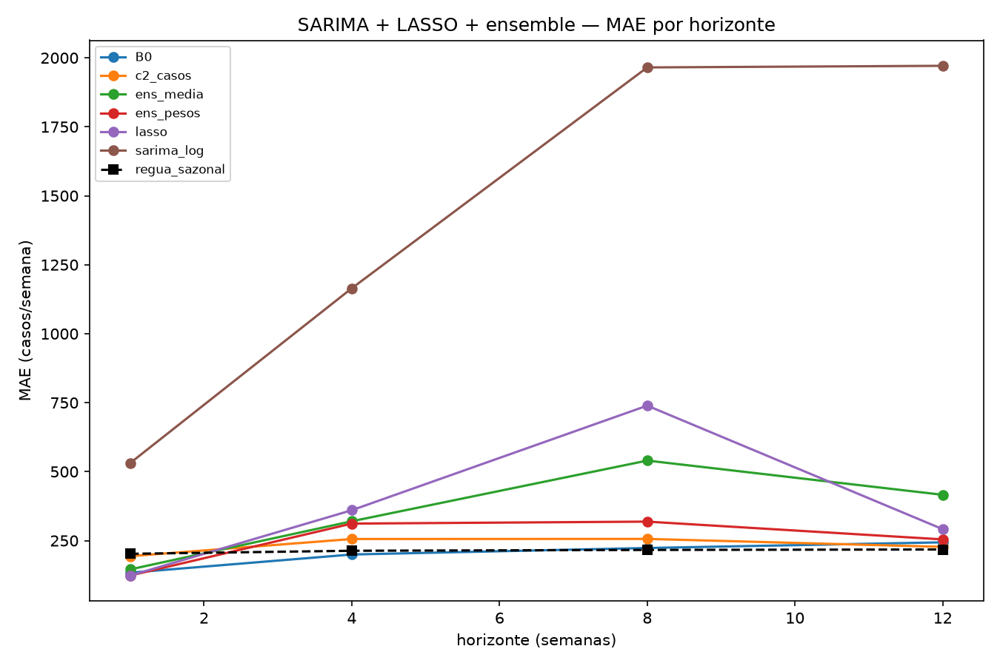

# SARIMA, LASSO quantílico e ensemble

> **Rodada em 25/09/2026**, a pedido do Vinicius ("pode fazer o a+b"). Protocolo em
> [PRE_DECLARACAO.md](PRE_DECLARACAO.md), escrito antes de rodar. Revisão pré-rodada em
> [REVISAO_PRE_RODADA.md](REVISAO_PRE_RODADA.md). Certificação em [CERTIFICACAO.md](CERTIFICACAO.md).
>
> ⚠️ **Rodada exploratória.** A avaliação 2024+ já tinha sido vista.

---

## Em uma frase

**Pelo critério pré-declarado, nada passa: SARIMA e LASSO explodem no começo da epidemia de 2024, e o
ensemble não bate a régua.** Mas a leitura descritiva, pela perda quantílica, mudou a pergunta. Ver §5.

---

## 1. Propósito

- O [catálogo de modelos prontos](../2026-09-25_catalogo_modelos_prontos/) apontou dois modelos
  estatísticos que vencem em 12 semanas: **SARIMA**, no Dengue Forecasting Project, e **LASSO**, em
  produção em Singapura.
- E apontou que **ensembles** venceram a régua em 1-3 meses.
- A regressão linear de 25/09 tinha explodido por falta de penalização; o LASSO é a mesma família **com**
  penalização L1.

---

## 2. Travas — as cinco passaram

| Trava | Resultado | Verificada por |
|---|---|---|
| 1. Pareamento | 102 pares por horizonte em todos os braços | combinador |
| 2. Sem futuro | última data do ajuste do SARIMA = origem em 1.159 linhas; LASSO e ensemble conferidos | combinador + certificação |
| 3. Âncoras | B0, régua e `c2_casos` reproduzidos | combinador |
| 4. Determinismo | 10 de 10 origens repetidas idênticas | certificação |
| 5. Clima do LASSO = clima do B0 | as mesmas 6 colunas | certificação |

A equivalência do LASSO com `alpha=0` e o V5 da bateria de formulação também foi provada: rtol 1e-8.

---

## 3. Resultado pelo critério pré-declarado

MAE do q0,85, avaliação 2024+, 102 semanas por horizonte:

| Braço | h=1 | h=4 | h=8 | h=12 |
|---|---|---|---|---|
| `sarima_log` | 531,2 | 1.164,7 | 1.965,2 | 1.971,0 🔴 |
| `lasso` | **123,2** | 360,1 | 739,2 | 291,5 |
| `lasso_M0` | 142,1 | 232,7 | 289,6 | 267,4 |
| `ens_media` | 145,6 | 320,1 | 540,1 | 416,0 |
| `ens_pesos` | 123,4 | 311,6 | 318,8 | 254,3 |
| B0 | 133,6 | **199,6** | 223,2 | 243,8 |
| régua sazonal | 202,1 | 213,2 | **216,2** | **217,8** |

| Critério, em h=12 | Veredito |
|---|---|
| Bate a régua? | **Não**, nenhum braço |
| Melhora o B0? | **Não**, nenhum braço |
| O vetor vale no LASSO? | **Não**: p Holm 0,995 |
| Candidato a 2026-2027? | **Nenhum** |

- **Todas as comparações significativas de J1 e J2 são pioras.**
- O LASSO escolheu `alpha = 0,001`, o menor da grade, em todos os horizontes. Na prática, quase sem
  penalização.

---

## 4. Por que explodem

Reproduzido do zero pela certificação, com diferença de 0,0%:

- **SARIMA**, origem 04/02/2024, h=12: previu **43.423** casos para uma semana que teve **1.347**.
  - Os casos tinham saltado de 7 para 80 em 10 semanas, o começo da epidemia de 2024.
  - O ajuste deu AR(1) = 0,635 e AR(2) = 0,310, soma **0,945**, perto da raiz unitária. A correção
    demora ~12 semanas para decair, o próprio horizonte.
  - 🔴 **Isso refuta uma premissa da pré-declaração:** "sem constante, a correção some com o horizonte e
    converge para a régua". Com o AR perto da raiz unitária, não converge.
- **LASSO**, origem 03/03/2024, h=8: previu **15.317** para uma semana que teve **1.347**. A regressão
  linear em log extrapola um ponto fora da distribuição do treino.
- **SARIMA:** 18 a 20 das 102 semanas de avaliação caíram na régua por falha de convergência, como
  pré-declarado.
- **Limitação de arquitetura, agora em quatro modelos:** o resíduo sobre o ano anterior, a regressão linear, o
  SARIMA e o LASSO explodem no começo de uma epidemia. **Modelo linear ou autorregressivo em log, sem
  saturação, não serve para esta série.** A árvore não explode porque satura nas folhas.

### Quem o ensemble escolheu

Pesos médios do `ens_pesos` na avaliação:

| h | B0 | Chronos-2 | SARIMA | LASSO | régua |
|---|---|---|---|---|---|
| 1 | 0,29 | 0,24 | 0,02 | **0,45** | 0,00 |
| 4 | 0,33 | **0,53** | 0,04 | 0,07 | 0,03 |
| 8 | **0,51** | 0,25 | 0,09 | 0,06 | 0,10 |
| 12 | **0,33** | 0,19 | 0,11 | 0,25 | 0,12 |

- A régua recebe só **0,12** em h=12, embora seja a melhor pelo MAE na avaliação. Os pesos são aprendidos
  com o passado, e nele a régua não era a melhor.

---

## 5. 🔴 A leitura que mudou a pergunta: a perda quantílica

⚠️ **Descritivo, pós-hoc.** A métrica primária pré-declarada foi o MAE. O que segue precisa de
pré-declaração própria antes de virar resultado.

### O problema de medir um quantil com MAE

- O projeto prevê o **quantil 0,85**: um patamar que deveria ser ultrapassado em 15% das semanas. A escolha
  foi deliberada, porque subestimar surto custa mais caro.
- **O MAE é minimizado pela mediana.** Julgar um quantil 0,85 pelo MAE pune justamente o que ele foi
  desenhado para fazer: ficar acima.
- **A métrica coerente com a escolha do projeto é a perda quantílica 0,85**, que pune a subestimação 5,7
  vezes mais que a superestimação, 0,85 contra 0,15. É também a peça que compõe o WIS, a métrica dos
  sprints nacionais.

### O que a perda quantílica mostra

Perda quantílica 0,85, avaliação 2024+, menor é melhor:

| h | cenário adotado | B0 | **Chronos-2 só casos** | `ens_pesos` | régua |
|---|---|---|---|---|---|
| 1 | 62,1 | 71,2 | 32,3 | **24,0** | 157,3 |
| 4 | 151,5 | 135,9 | **57,2** | 68,9 | 166,9 |
| 8 | 218,6 | 182,1 | **84,5** | 140,6 | 169,5 |
| 12 | 227,1 | 191,2 | 100,9 | **94,2** | 170,6 |

- **FATO:** em 3 meses, o Chronos-2 tem perda **47% menor que o B0** e **41% menor que a régua**.
- **Comparação justa é contra o B0**, porque os dois são quantis 0,85. A régua é uma previsão pontual e
  sai prejudicada nessa métrica.
- Wilcoxon do Chronos-2 contra a régua na perda por semana: p bruto **< 0,01** nos 4 horizontes. É
  pós-hoc, e não vale como teste.

### O nosso quantil 0,85 não é um quantil 0,85

Cobertura na avaliação, a fração de semanas com o real abaixo da previsão. O nominal é **0,85**:

| h | cenário adotado | B0 | Chronos-2 |
|---|---|---|---|
| 4 | 0,51 | 0,56 | **0,73** |
| 8 | 0,34 | 0,39 | **0,66** |
| 12 | **0,35** | 0,42 | **0,70** |

- **FATO:** em 3 meses o "quantil 0,85" do cenário adotado é ultrapassado em **65%** das semanas, não em 15%.
  Ele subestima de forma sistemática nas duas maiores temporadas.

### É contaminação do pré-treino?

Perda quantílica 0,85 em h=12 por ano:

| Ano | B0 | Chronos-2, out/2025 | Chronos-Bolt, nov/2024 | régua |
|---|---|---|---|---|
| 2022 | 93,6 | 110,3 | 118,0 | 98,9 |
| 2023 | 45,8 | 68,7 | 104,1 | 45,9 |
| 2024 | 269,7 | **192,9** | 240,5 | 237,1 |
| 2025 | 141,3 | **30,6** | **69,6** | 128,8 |

- Em 2022-2023, o Chronos-2 não é melhor que o B0 em h=12. A vantagem mora em 2024-2025.
- **O Bolt não pode ter visto 2025 e também vence nesse ano**: 69,6 contra 141,3 do B0. A vantagem em 2025
  não é só contaminação.
- Em h=4, o Chronos-2 vence o B0 **em todos os anos** de 2022 a 2025. Ver o CSV de leituras.

---

## 6. O que muda, e o que não muda

### Não muda

- **Pelo MAE, a régua segue invicta em 3 meses.** Nada passou no critério desta rodada.
- **SARIMA e LASSO estão descartados** nesta série. Explodem.

### Muda

- **A pergunta "qual modelo é melhor?" depende da métrica, e a métrica é uma definição de produto.**
  - Se o custo de subestimar e o de superestimar forem iguais, vale o MAE, e a régua vence.
  - Se subestimar custar mais, que é a premissa declarada do projeto, vale a perda quantílica, e o
    Chronos-2 vence o nosso modelo com folga.
- **O cenário adotado tem um problema de calibração:** o quantil 0,85 dele se comporta como um quantil
  ~0,35 nas temporadas grandes.

---

## 7. Incidentes de execução

1. **Antes da rodada:** a revisão apontou que a trava 2 do SARIMA era tautológica, porque gravava a origem
   no lugar da última data real do contexto. Corrigido para `contexto["data"].max()`.
2. **O combinador quebrou na trava 2:** recebia a tabela já resumida do SARIMA, sem a coluna de data.
   Ligada a tabela bruta; SARIMA e LASSO não foram re-rodados. Log em
   [`execucao_3_combinar_falhou_trava2.log`](execucao_3_combinar_falhou_trava2.log).
3. **O combinador não gravava as previsões do ensemble nem as leituras descritivas da §4.** Acrescentada a
   gravação ([`execucao_4_combinar_grava_previsoes.log`](execucao_4_combinar_grava_previsoes.log), mesmos
   números) e o script [`leituras_descritivas.py`](leituras_descritivas.py).

---

## 8. Arquivos

| Arquivo | O que é |
|---|---|
| [`PRE_DECLARACAO.md`](PRE_DECLARACAO.md) | protocolo |
| `rodar_sarima.py` · `rodar_lasso.py` · `combinar_e_avaliar.py` · `leituras_descritivas.py` | os scripts |
| `requisitos_travados_venv.txt` | o ambiente isolado com o `statsmodels` 0.15.0 |
| `saidas/previsoes_por_braco.csv` | todas as previsões, 7 braços |
| `saidas/familia_j1_*.csv` · `j2` · `j3` | as famílias, com MAE e direção |
| `saidas/leitura_pesos_medios_ens_pesos.csv` | quem o ensemble escolheu |
| `saidas/leituras_descritivas.csv` | MAE, perda quantílica e cobertura por recorte e por ano |
| `saidas/alphas_escolhidos_lasso.csv` | alphas e colunas zeradas |
